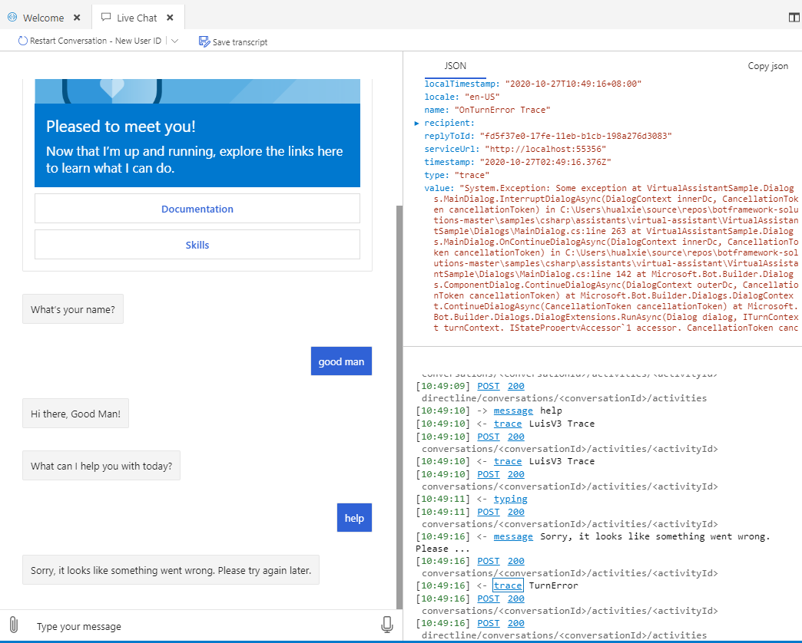
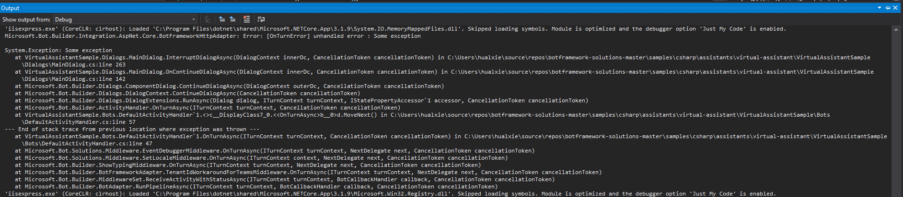

# Check list of VA, Skill and OAuth

Hope this will be a complete check list for authenticating skill in VA.
(Sadly, it is quite complex!)

## Test VA locally

- Clone [VirtualAssistantSample](https://github.com/microsoft/botframework-solutions/tree/master/samples/csharp/assistants/virtual-assistant/VirtualAssistantSample)
- Deploy [VirtualAssistantSample](https://microsoft.github.io/botframework-solutions/virtual-assistant/tutorials/create-assistant/csharp/4-provision-your-azure-resources/)
    - Check appsettings.json and it should contain microsoftAppId, microsoftAppPassword etc.
    - Check cognitivemodels.json and it should contain languageModels etc.
- Run locally in Visual Studio & [Emulator](https://microsoft.github.io/botframework-solutions/virtual-assistant/tutorials/create-assistant/csharp/5-run-your-assistant/)
    - If something bad happens, one could view the stacktrace in Emulator  and Visual Studio  They could help to debug the code and create issues
    - More about [debugging](https://docs.microsoft.com/en-us/azure/bot-service/bot-service-debug-bot?view=azure-bot-service-4.0&tabs=csharp)

## Test Skill locally

- Clone [ToDo Skill](https://github.com/microsoft/botframework-skills/tree/main/skills/csharp/todoskill) (take todo as an example)
- Deploy [ToDo Skill](https://microsoft.github.io/botframework-solutions/skills/tutorials/create-skill/csharp/4-provision-your-azure-resources/)
- Add [authentication](https://microsoft.github.io/botframework-solutions/skills/handbook/authentication/) if not configured correctly
    - Check appsettings.json and it should contain microsoftAppId, microsoftAppPassword, oauthConnections etc.
    - Check cognitivemodels.json and it should contain languageModels etc.
- Run locally in Visual Studio & [Emulator](https://microsoft.github.io/botframework-solutions/skills/tutorials/create-skill/csharp/6-run-your-skill/)
    - Try login and see if exception happens

## Test Skill in VA locally

- Update skill's manifest skills\csharp\todoskill\wwwroot\manifest\manifest-1.1.json
    - {YOUR_SKILL_URL} to localhost like http://localhost:3980
    - {YOUR_SKILL_APPID} to appsettings.json's microsoftAppId
- [Add skill to VA](https://microsoft.github.io/botframework-solutions/skills/tutorials/create-skill/csharp/7-add-your-skill/)
    - Use [localManifest](https://github.com/microsoft/botframework-solutions/blob/master/tools/botskills/docs/commands/connect.md) instead of remoteManifest this time
    - Check VA's appsettings.json and it should contain BotFrameworkSkills, SkillHostEndpoint (change this to local if not)
- [Enable SSO for skill](https://microsoft.github.io/botframework-solutions/overview/whats-new/1.0/enable-sso-with-skills-using-oauthcredentials-setting/)
    - Note that skill can't be used directly after this setup
- Run both VA & skill locally in Visual Studio and use Emulator to connect VA
    - Try login skill and see if error happens

## Test in Teams locally

- Configure [ngrok](https://ngrok.com/) for VA
    - Set [-host-header="localhost:3978"](https://microsoft.github.io/botframework-solutions/help/known-issues/#http-500-error-when-invoking-a-skill)
    - Update VA's appsettings.json's SkillHostEndpoint
- Update VA's [Messaging endpoint](https://docs.microsoft.com/en-us/azure/bot-service/bot-service-manage-settings?view=azure-bot-service-4.0) in Azure
- [Add to Teams](https://microsoft.github.io/botframework-solutions/clients-and-channels/tutorials/enable-teams/2-add-teams-channel/)
    - [Note add token.botframework.com to Valid Domains in Domains and permissions](https://docs.microsoft.com/en-us/microsoftteams/platform/bots/how-to/authentication/add-authentication?tabs=dotnet%2Cdotnet-sample)
- Try login skill and see if error happens
    - More about [debugging](https://docs.microsoft.com/en-us/azure/bot-service/bot-service-debug-channel-ngrok?view=azure-bot-service-4.0)

## Deploy Skill

- We should already have azure app when deploying, so publish it in Visual Studio
- Update skill's Messaging endpoint in Azure
- Try in 'Test in Web Chat' and see if error happens
    - Try help etc. Not login

## Deploy VA

- We should already have azure app when deploying
    - Update appsettings.json's SkillHostEndpoint to azure app url
    - Update appsettings.json's ToDoSkill's SkillEndpoint to skill's azure app url
- Then publish it in Visual Studio
- Update VA's Messaging endpoint in Azure
- Try login in 'Test in Web Chat' and see if error happens

## Test in Teams

- Install app again and the url for bot should already be changed
- Try login skill and see if error happens
